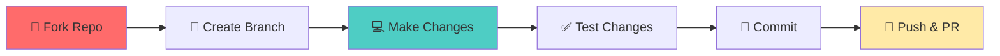

<div align="center">

# 🚀 Shawon Biswas (Flutter Developer)


[](https://visitcount.itsvg.in)

</div>

<div align="center">
  
[](https://flutter.dev)
[](https://dart.dev)
[](https://firebase.google.com)
[](https://developer.android.com/studio)
[](https://code.visualstudio.com)

</div>

---

## 🌟 About Me


### 👨‍💻 Hello, I'm Shawon Biswas!

🚀 **Passionate Flutter Developer** transforming ideas into stunning cross-platform mobile applications

💡 **Creative Problem Solver** with expertise in modern development practices and user-centric design

🎯 **Technology Enthusiast** constantly exploring cutting-edge frameworks and development methodologies

📚 **Lifelong Learner** committed to mastering the latest trends in mobile development

🌐 **Open Source Advocate** actively contributing to the developer community

💻 **Full-Stack Mobile Engineer** experienced in end-to-end mobile solutions

🎨 **UI/UX Focused** creating beautiful, intuitive, and performant user experiences

<br clear="both">

---

<div align="center">

### 🎯 What Drives Me

| 🚀 Innovation | 💡 Creativity | 🎯 Excellence | 🌟 Impact |
|:---:|:---:|:---:|:---:|
| Building tomorrow's apps today | Turning ideas into reality | Quality in every line of code | Making a difference through tech |

</div>

## 📊 GitHub Analytics

<div align="center">

### 🔥 My Coding Stats


### 💻 Most Used Languages


### 🏆 GitHub Trophies

[](https://github.com/ryo-ma/github-profile-trophy)

### 🐍 Contribution Snake


</div>

## 🛠️ Tech Stack & Tools

<div align="center">

### 📱 Mobile Development


### 🔥 Backend & Database


### 🎨 Design & UI/UX


### 💻 Development Tools


### 🚀 State Management & Architecture


</div>


## � Skills & Expertise

<div align="center">

### 🎯 Development Proficiency

</div>

<table>
<tr>
<td valign="top" width="33%">

### 📱 Mobile Development
```text
Flutter Development     ████████████ 95%
Dart Programming       ████████████ 90%
UI/UX Implementation   ██████████░░ 85%
Cross-platform Apps   ████████████ 90%
Responsive Design      ██████████░░ 80%
App Architecture       █████████░░░ 75%
```

</td>
<td valign="top" width="33%">

### 🔥 Backend & APIs
```text
Firebase Integration   ███████████░ 90%
REST API Consumption   ██████████░░ 85%
Local Data Storage     ███████████░ 88%
Authentication Systems █████████░░░ 75%
Cloud Functions        ██████░░░░░░ 60%
GraphQL                ████░░░░░░░░ 40%
```

</td>
<td valign="top" width="33%">

### 🛠️ Tools & Workflow
```text
Git Version Control    ████████████ 95%
Android Studio         ███████████░ 90%
VS Code                ████████████ 95%
Figma/Design Tools     ██████████░░ 80%
Testing & Debugging    █████████░░░ 70%
CI/CD Pipelines        █████░░░░░░░ 50%
```

</td>
</tr>
</table>

### 🚀 State Management Expertise
<div align="center">


</div>

## 📫 Let's Connect!

<div align="center">

### 🌐 Find Me Online

<a href="mailto:nobita105176@gmail.com">
  
</a>
<a href="https://www.linkedin.com/in/shawon105176/">
  
</a>
<a href="https://twitter.com/yourhandle">
  
</a>
<a href="https://yourportfolio.com">
  
</a>
<a href="https://discord.gg/yourserver">
  
</a>

### 💬 Let's Collaborate!

🤝 **Open for collaboration on:**
- 📱 Flutter mobile applications
- 🎨 UI/UX design projects  
- 🔥 Firebase backend solutions
- 📚 Open source contributions
- 🚀 Startup mobile apps

</div>

---


### 🔄 Contribution Workflow



### 🌟 Thank You for Visiting!

<div align="center">


**If you find my work interesting, please consider giving it a ⭐!**

[](https://github.com/Shawon105176)
[](https://github.com/Shawon105176)

---

<sub>💡 **Pro Tip:** Star ⭐ my repositories if you find them useful!</sub>

*Last updated: October 2025* 🗓️

</div>

